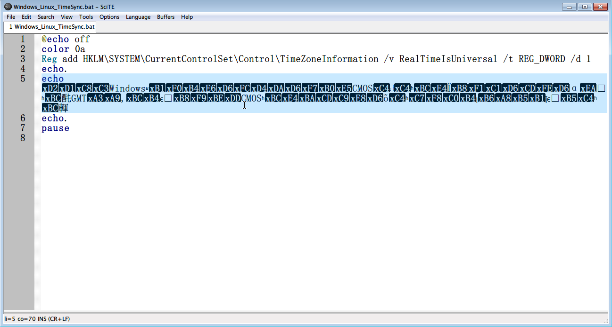
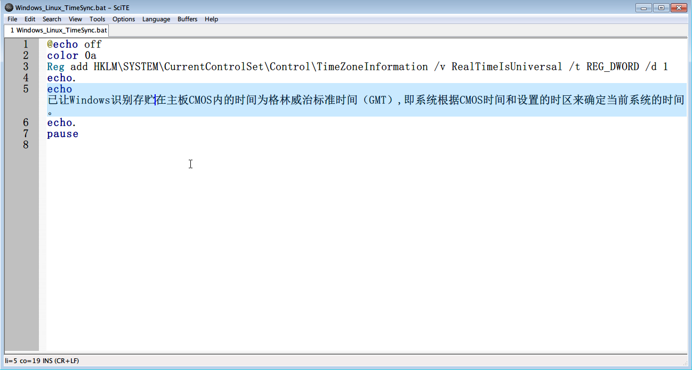

# 编码探测器

帮助 Scite 在打开文件时自动探测文件编码

使用 Scite 打开未知编码的文件时：



挂载本编码探测器后：



# 安装

```shell
go install -u https://github.com/Athlon64/encoding_detector
```

# 用法

在 Scite 配置文件中加入下面一行：

```shell
command.discover.properties=Your binary's path "$(FilePath)"
```

例如：

```shell
command.discover.properties=C:\Scite\Encoding_Detect.exe "$(FilePath)"
```
